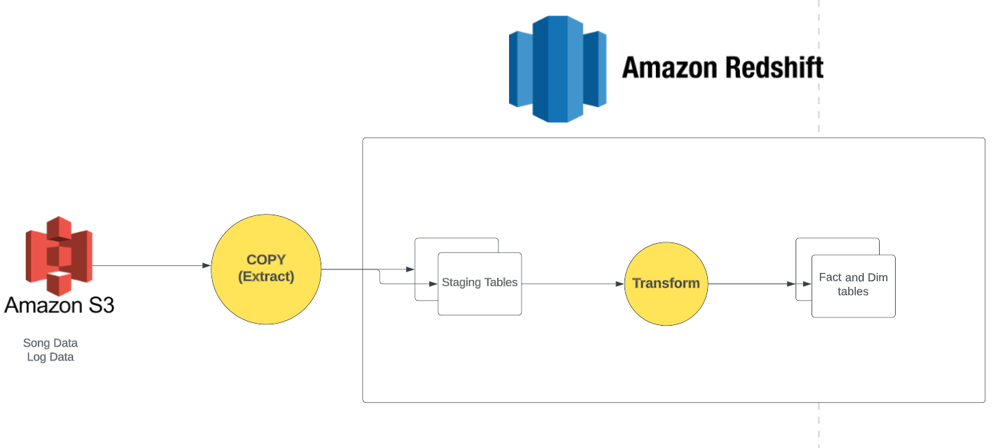

# Data Warehouse Using AWS RedShift
## What's a Warehouse
* A Datawarehouse is a place where several data sources are queried and transformed, to be ready for analytics.
* This usually happens when the requirements of the business transaction databases are optimized for OLTP, whereas analytics dbs are optimized for OLAP
* Transaction queries and analytics queries often have contradicting requirements in terms of databases.
* As such, we often separate the two processes into 2 different databases.
    * Transactions records are continuously fed to an ETL pipeline 
    * This pipeline transforms the Transaction queries into a format suitable for OLAP 
    * The data warehouse is then the palce where the transformed data that's ready for analytics resides

## Our Use Case
* As a music streaming app, we have our "transactions" as logs of user interaction with the App.
    * The data is stored as JSON files under `s3://udacity-dend/log_data/*`
* We also have metadata about the songs, like the song name, artist name, duration, 
    * The data is stored as JSON files under `s3://udacity-dend/song_data/*`
* To extract meaningful insights, we will need to 
    * Extract the data from S3 into staging tables on Redshift
    * Load the data back into a dimensional model that's suitable for analysis (a dimensional model)

* This can be illustrated in the following image


### The dimensional model
#### Fact Table
* `songplays` - records in event data associated with song plays i.e. records with page NextSong

`songplay_id`, `start_time`, `user_id`, `level`, `song_id`, `artist_id`, `session_id`, `location`, `user_agent`
#### Dimension Tables
* `users` - users in the app
    * `user_id`, `first_name`, `last_name`, `gender`, `level`
* `songs` - songs in music database
    * `song_id`, `title`, `artist_id`, `year`, `duration`
* `artists` - artists in music database
    * `artist_id`, `name`, `location`, `lattitude`, `longitude`
* `time` - timestamps of records in songplays broken down into specific units
    * `start_time`, `hour`, `day`, `week`, `month`, `year`, `weekday`

## How to run
* You'll need poetry to install the project and its dependencies
* Once you've installed the dependencies, in the command window, run 
```
poetry python main.py [--debug]
```
The script accepts a CLI flag `--debug` which sets the logger to display logs of `debug` severity or higher. Otherwise the level will be `info`

### Folder structure
* The project follows the `src` layout of python projects.
```Bash
.
├── data # sample data
│   ├── log_json_path.json
│   ├── sample_log.json
│   └── sample_song.json
├── dwh.cfg # the configuration file (S3 bucket names, IAM role name, redshift information,...)
├── images
│   └── flow.png
├── poetry.lock # poetry lock file (simialar to requirements.txt with exact versions)
├── pyproject.toml # project metadata.
├── README.md
└── src 
   ├── main.py  # entry point script
   └── redshift_project # package
       ├── __init__.py      
       ├── create_tables.py
       ├── etl.py           
       └── sql_queries.py

```
* Poetry installs the project, in editable mode, as a package, named `redshift_project`.
* This is similar to how we would create a `setup.py` file.
* In doing so, we can import modules and functions under the `redshift_project` package anywhere in our project.


## Issues I faced
* We must define attributes in the same order as they appear in the JSON file when creating the events staging table. This is because we told the COPY command what schema to use. Otherwise, attributes will not be assigned correctly, and errors will occur
* We must specify the timeformat in the COPY command to be milliseconds. Otherwise the timestamp will not be parsed successfully
* Some attributes have long strings that can go out of range of a default `text` attribute. For that, use `VARCHAR(MAX)`
* The song data in S3 is distributed across lots of files. So copying over the entire song data is very time consuming, esepcially with a small cluster. When experimenting, while using one node for example, limit the files you're copying. For example, limit only songs in the `/A/A/A` directory in the COPY command. 

## TODOs
* Provision the infrastructure automatically via an IaC tool like Terraform or Pulumi